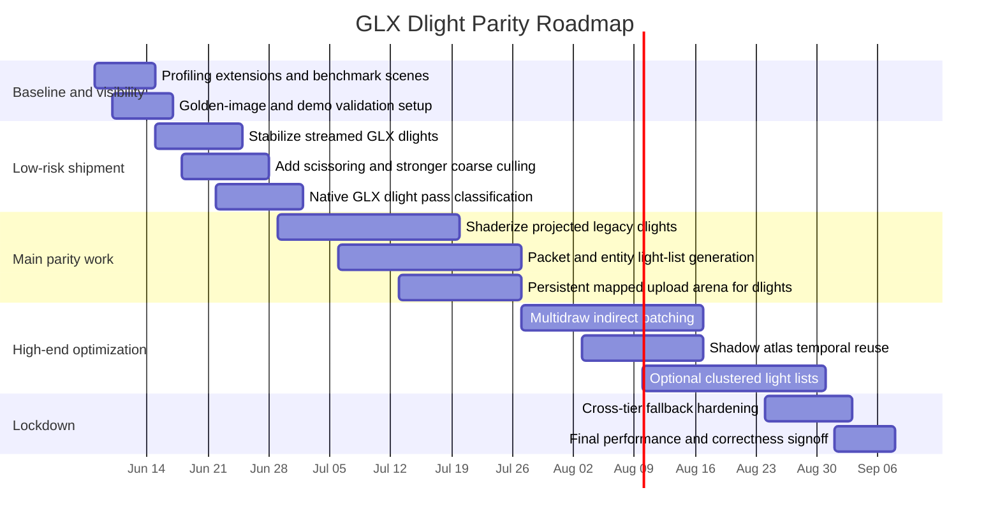

# GLX Dynamic Light Optimization Plan for FnQ3

## Executive Summary

FnQ3’s GLX path already contains most of the scaffolding needed for a modernized dynamic-light pipeline: a staged render IR, a stream-upload subsystem with GPU fences, a material compiler/compatibility bridge, and a profiler that can capture non-blocking backend GPU timings, per-pass timings, draw-call counts, legacy-delegation counts, and material-stage histograms including dlight stages. But the audited dlight path is still dominated by legacy renderer behavior: extra projected-light passes are generated from compatibility code, dlight streamed draws are explicitly marked “experimental” and disabled by default, and the highest-capability GLX tier only reaches its intended shape when persistent uploads, indirect submission, and direct state access are available. In other words, GLX has the infrastructure for parity, but dlights have not yet been fully moved onto that infrastructure. citeturn29view0turn29view2turn33view5turn38view2turn51view0

The most important repo-level finding is that Vulkan is not winning here because FnQ3 uses a radically different legacy-dlight lighting equation in `renderervk`; the legacy projected-dlight algorithm is still present there too. The likely gap is execution-model efficiency: Vulkan-style stable pipelines, cached image descriptors, better scratch/data reuse, lower submission overhead, and less driver mediation. The Vulkan path stores per-image descriptors once at image initialization, keeps per-stage pipeline handles in `shaderStage_t`, and even reuses `tess.svars` arrays for projected dlight work instead of separate stack scratch arrays in the non-Vulkan path. That strongly suggests that bringing GLX closer to VK is less about inventing a new light formula and more about moving GLX dlights from compatibility-era per-pass CPU work into a first-class programmable, batched, persistently streamed path. citeturn46view2turn50view0turn50view1turn50view2

My recommended plan is tiered. For immediate gains, keep existing visuals and make the current GLX streaming/profiling path authoritative for dlights: enable instrumentation, stabilize `r_glxStreamDrawDynamicLights`, remove avoidable scratch-buffer churn, and add tighter culling and scissoring. For the medium term, replace CPU-generated per-vertex dlight texcoords/colors with shader-evaluated dlights using UBO/SSBO light records and per-surface or per-packet light lists. For the high-end GLX tier, explicitly target the capabilities that FnQ3’s own render-IR policy already advertises for modern GL: persistent mapped uploads from `ARB_buffer_storage`, sync-aware ring buffering, indirect submission, and direct-state-access-style object management. That is the practical route to GLX/VK parity on modern hardware; exact parity on older GL2/early-GL3 capability tiers is not a realistic engineering target. citeturn51view0turn51view1turn47search7turn48search6turn49search0turn49search1

## Files Inspected in themuffinator/FnQ3

I inspected the GLX-native files most directly relevant to draw submission, profiling, material classification, render scheduling, and dynamic/static geometry ownership: `code/rendererglx/glx_executor.cpp`, `glx_profiler.cpp`, `glx_stream.cpp`, `glx_static_world.cpp`, `glx_material.cpp`, `glx_material.h`, `glx_material_key.h`, and `glx_render_ir.h`. These files define the current GLX execution tiers, profiling counters, stream-upload runtime, material-stage classification, and frame-pass schedule that any dlight optimization must fit into. citeturn7view0turn9view1turn9view3turn9view4turn9view5turn15view0turn15view1turn15view2turn15view3

I also inspected the legacy/compatibility renderer files that still drive today’s dlight behavior and therefore represent the true current production path for GLX dlights: `code/renderer/tr_light.c`, `tr_shade.c`, `tr_backend.c`, `tr_glx_compat.h`, `tr_local.h`, and `tr_scene.c`. For shadow and pass-structure context I also checked `tr_shadows.c`. These files contain the legacy projected-dlight algorithm, dlight transforms and culling, compatibility flags that mark a material stage as a dlight stage, and the hooks that attempt to route compatible stages into GLX streaming. citeturn18view0turn18view1turn18view2turn18view4turn18view5turn32view0turn41view0

Finally, I inspected the Vulkan-side counterparts needed for comparison: `code/renderervk/tr_light.c`, `tr_local.h`, `tr_shade.c`, `tr_backend.c`, `vk.c`, and `vk_vbo.c`. In FnQ3, those files show that legacy dlight math still exists on the Vulkan side, but Vulkan also benefits from per-stage pipeline objects, stable per-image descriptors, and less transient per-pass setup. citeturn43view0turn44view0turn44view1turn44view2turn44view3turn44view4turn44view5

## Current GLX Dlight Audit

### Legacy dlights and promode lights in the current renderer

FnQ3’s dlight subsystem has two distinct families. The first is the legacy VQ3-style projected-light path guarded by `USE_LEGACY_DLIGHTS`, with `ProjectDlightTexture` performing dynamic lighting as an additional rendering pass. The second is the promode/per-pixel path guarded by `USE_PMLIGHT`, where `R_GetDlightMode()` returns mode `1` or `2`, and where `dlight_t` also carries shadow-planning state such as `shadowPlanned`, `shadowIndex`, atlas face coordinates, receiver count, and priority. The same `tr_local.h` also makes clear that each view can carry its own dlight array and count. citeturn22view5turn40view0turn20view5

The front-end work is straightforward but expensive in aggregate. `R_TransformDlights` transforms every light origin into local space; `R_DlightBmodel` retransforms all dlights for a bmodel, AABB-tests them against the model bounds, sets a bitmask, and writes that mask into each affected surface; `R_DlightCullEntityBounds` adds a cheap world-space rejection test for entity bounds under `USE_PMLIGHT`; and `R_SetupEntityLighting` accumulates directed light and light direction by looping over all dynamic lights. Those are classic Quake-era algorithms: simple, predictable, and correct, but O(number of lights × number of entities/surfaces/vertices) in the hot path. citeturn20view0turn21view0turn21view4turn21view5turn22view1turn23view0turn22view4

The hottest legacy path is `ProjectDlightTexture`. In the current renderer, that function loops over each dlight that survives `tess.dlightBits`, computes projected 2D texcoords from the light-space X/Y offset for every vertex, uses the normal-dot-light test and light Z extent to clip backfaces and out-of-range fragments, computes a per-vertex color modulation, stores clip bits, then builds a triangle list of touched indices for the extra pass. That means the cost scales per light, per affected batch, per vertex, and per index, while also paying the costs of additive blending and extra submission. citeturn24view0turn24view1turn50view1turn50view2

### How GLX currently touches that path

The repo shows that GLX is still, in practice, downstream of the legacy batcher for dlights. `DrawMultitextured` in `tr_shade.c` calls `GLX_TryStreamDrawStage` for eligible stages, and `tr_glx_compat.h` converts legacy shader-stage properties into GLX material records via `GLX_CompatRecordMaterialStage`. Critically, `GLX_CompatMaterialStageFlags` marks any bundle with `dlight` set as `GLX_STAGE_DLIGHT_MAP`, and the dynamic-category logic classifies pure dlight-map work as a “special” dynamic category when it has no stronger category already. That is a strong signal that dlights are still compatibility-translated exceptions, not first-class GLX-native render-IR nodes. citeturn24view1turn33view5turn34view1turn36view0

GLX does have the beginnings of a higher-performance route. The stream subsystem exposes runtime cvars for streamed draws, including `r_glxStreamDrawDynamicLights`, whose description explicitly says it enables “experimental” streamed draws for dynamic-light map stages when stream drawing is enabled. The same subsystem manages frame fences and ring-buffer behavior across frames, waiting for previous sync objects when needed and inserting new fences at frame completion. So the basic machinery required for low-overhead transient uploads already exists, but dlights are not yet a stable, default, always-on client of it. citeturn29view0turn29view2

The GLX render-IR layer also shows why the audited shape was unsatisfying. At the time of this audit, FnQ3’s pass schedule included `FrameSetup`, `SkyAndOpaqueWorld`, `OpaqueEntities`, `DynamicScene`, `TransparentLayers`, `FirstPersonWeapon`, `HudAnd2D`, `PostProcess`, and `OutputExport`, but there was no explicit dedicated “dlight accumulation” pass. Subsequent implementation work added a native `DynamicLights`/`dynamic-lights` frame-pass slot after opaque entity work and before transient dynamic-scene effects, made `DynamicDrawRole::DynamicLight` default to that slot for future dlight products, and added executor role/pass draw-index-vertex counters for accepted dynamic draw products. Meanwhile, `FrameProducts` already separates `worldPackets` from `dynamicDraws`, which is exactly the kind of structure you would want if you were going to bin lights per packet and batch dlight draws cleanly. citeturn30view2turn30view4turn30view5

### What Vulkan is already doing better in this repo

The Vulkan side of FnQ3 is instructive because it keeps much of the same legacy light behavior while reducing execution overhead. In `renderervk/tr_shade.c`, Vulkan still has `ProjectDlightTexture`, so there is no evidence of a completely different legacy-dlight lighting model there. But under `USE_VULKAN` that function returns a boolean, uses pipeline handles, and reuses `tess.svars` texcoord/color storage instead of fallback scratch arrays. In `renderervk/tr_local.h`, `shaderStage_t` carries `vk_pipeline` and related pipeline IDs, and `image_t` stores a `VkDescriptorSet` that the repo comments say is updated only once during image initialization. That is exactly the kind of stable state model that reduces per-draw churn. citeturn46view0turn50view0turn50view1turn46view2

The GLX render-IR policy confirms that the project already recognizes the same end state on the OpenGL side. Its highest-capability policy turns on timer queries, sync-aware uploads, static and dynamic buffer ownership, persistent uploads, indirect submission, and direct state access, and it marks debug output, buffer storage, and DSA as required for that tier. So the repo itself is already telling you what “GLX on par with VK” should mean architecturally on modern GL: fewer driver-mediated updates, more persistent ownership, and fewer draw-submission calls. citeturn51view0turn51view1turn51view2turn51view3turn51view4turn51view5

## Profiling Methodology and Expected Hotspots

The profiling plan should lean on the instrumentation FnQ3 already has and add only the counters that are still missing. The existing GLX profiler can already collect non-blocking backend GPU timings with timer queries, per-pass GPU timings, total draw calls, generic/device/VBO/streamed draw counts, legacy-delegation counts, shader-batch sizes, and histograms of material-stage properties including dlight-stage counts. Khronos documents `GL_TIME_ELAPSED` and timestamps as nanosecond timer queries, and FnQ3 already wires those concepts into `r_glxGpuTiming` and `r_glxGpuPassTiming`. citeturn37view4turn37view5turn37view0turn38view2turn39view1turn47search6turn47search9

The matrix below is the minimum measurement set I would use before touching code and again after each milestone. The first four rows come almost entirely from existing FnQ3 counters; the others should be added as lightweight extensions of the same profiler and stream runtime. The reason to be disciplined here is simple: with legacy projected dlights, you can easily “optimize” the wrong thing if you cannot separate CPU submission cost from GPU blend/fill cost. citeturn37view0turn38view2turn29view2turn48search3turn48search6

| Metric | How to capture it | Why it matters |
|---|---|---|
| CPU frame and backend time | Existing backend timers plus host-side scopes around dlight build, light culling, and dlight draw submission | Separates front-end list building from actual GL submission cost |
| GPU frame time | `r_glxGpuTiming` with timer queries | Establishes whether the scene is CPU-bound or GPU-bound citeturn37view4turn47search9 |
| GPU pass timings | `r_glxGpuPassTiming`; watch `dynamic-scene`, transparent work, and `dlight-shadow-atlas` when shadows are on | Identifies whether shadow atlas work or additive lighting work is dominant citeturn37view4turn39view2 |
| Draw-call mix | Existing profiler counters: total, generic, vbo-device, vbo-soft, stream-generic, legacy delegation | Finds whether the dlight path is escaping the intended GLX route and falling back to legacy submission citeturn37view0turn38view3 |
| Dlight stage pressure | Existing `dlightMapMaterialStages`, hot material keys by index pressure | Tells you which material variants are driving dlight cost and whether variant explosion is occurring citeturn38view2 |
| Upload bytes and ring behavior | Extend `glx_stream` to report bytes/frame, wrap count, wait count, reserve failures, fence waits | Detects streaming contention and whether uploads are stalling the CPU |
| State-change counts | Add counters for program binds, texture binds, VAO/VBO changes, FBO changes, blend/depth toggles | Dlights often lose not because of math, but because they explode state churn |
| Overdraw/blend load | Per-capture analysis in a graphics debugger plus in-engine scissor coverage stats | Legacy projected dlights are additive extra passes; fill and blending can dominate |
| Shadow-atlas churn | Count shadow faces rendered, reused, invalidated, and skipped per frame | Shadowed promode lights can become the hidden long pole |
| Correctness drift | Golden-image deltas, demo playback determinism, histogram deltas on lit surfaces | Prevents “faster but visually wrong” regressions |

The expected hotspots are not subtle. First, `ProjectDlightTexture` is almost certainly a top CPU hotspot in dlight-heavy scenes because it performs CPU-side per-vertex work and index compaction for every surviving light and batch. Second, additive extra passes mean GPU time can become fill/blend bound even after CPU work is improved. Third, the compatibility bridge means some dlight work will still show up as legacy delegation unless dlights are made first-class GLX work. Fourth, promode shadowed dlights need separate scrutiny because the profiler explicitly names a `dlight-shadow-atlas` GPU pass and `dlight_t` carries atlas/receiver metadata. citeturn24view0turn50view1turn50view2turn36view0turn39view2turn40view0

## Optimization Strategies and Vulkan Techniques to Emulate

### The strategy in one sentence

Do not try to “micro-optimize” the current projected-pass loop into parity. Instead, turn dlights into a tiered GLX-native system: preserve legacy visuals where required, but shift the hot path from CPU-generated per-light scratch arrays and extra compatibility draws toward shader-evaluated lights, persistently mapped ring buffers, coarse light lists, and high-end indirect submission. That matches both Khronos guidance on OpenGL streaming and the trajectory already encoded in FnQ3’s own GLX high-end policy. citeturn47search7turn48search6turn49search0turn49search1turn51view0

### Short-term work that should land first

The first objective should be to make today’s GLX path measurable and less wasteful without changing visuals. Enable and harden `r_glxStreamDrawDynamicLights`; add explicit profiler counters for dlight upload bytes, ring-buffer wraps, and fence stalls; reuse persistent per-thread scratch storage instead of repeatedly relying on large local arrays for dlight scratch; add screen-space scissor rectangles per dlight batch to reduce blend overdraw; and cache transformed light-space values for static world packets so that repeated work is not redone per small submission. This phase should keep the legacy projected-light formula intact while reducing submission and transient-memory overhead. It also provides the baseline data you need before undertaking shaderization. citeturn29view0turn29view2turn24view0turn50view1

A particularly important GLX-specific fix is to stop treating dlight stages as merely “special” compatibility material stages. Introduce a first-class dlight stage path in the GLX material/IR machinery so that the executor can recognize them directly, batch them aggressively, and report them separately. Right now the compatibility layer records stage traits and tags dlight stages with `GLX_STAGE_DLIGHT_MAP`; that is valuable, but it is not the same as having a native GLX dlight node with known inputs, known outputs, and known batching rules. citeturn33view5turn34view1turn36view0

### Medium-term work that will move the needle most

The biggest real win is to move legacy projected-dlight math out of the CPU hot path. Today the engine computes projected texcoords and per-vertex modulation on the CPU, then emits another draw. On GL 3.3 and above, that math should move into a programmable vertex/fragment path fed by a compact light record. For low-risk compatibility, keep the same visual model: a light parameter block with position, radius, color, and flags; a shader that reproduces the current projected XY coordinates and Z-based modulation; and a coarse per-surface or per-packet light list. The gain is that you stop uploading light-generated per-vertex texcoords/colors for every light and instead upload only light records and light-index lists. Shader storage blocks are well suited to this because they allow large buffer-backed data structures, and the final member of a shader storage block can be dynamically sized by buffer size. citeturn24view0turn50view1turn50view2turn48search22turn48search15

A practical stepping stone is “packet-local forward lighting” instead of full clustered lighting. FnQ3’s GLX IR already distinguishes `worldPackets` and `dynamicDraws`, so use that. For each visible static-world packet, generate a compact list of affecting dlights. For dynamic entities, keep a small per-draw light list built from AABB rejection similar in spirit to `R_DlightCullEntityBounds`. In the shader, loop only over the small local list. This avoids the combinatorial cost of `ProjectDlightTexture` without demanding a full deferred renderer or a full compute-driven clusterer on day one. citeturn21view4turn30view2

On high-end GL, move those local lists to SSBOs and batch submission further with multidraw indirect. Khronos’ `ARB_multi_draw_indirect` and the OpenGL reference page both emphasize that `glMultiDrawElementsIndirect` exists specifically to submit many indexed draws with very few CPU calls. Coupled with persistent mapped buffers from `ARB_buffer_storage`, this is the nearest OpenGL analogue to Vulkan-style “record once, submit many” geometry dispatch. FnQ3’s own GLX high-end policy already identifies persistent uploads and indirect submission as the intended differentiators of the most capable tier, so dlights should be one of the first systems to exploit them. citeturn49search0turn49search1turn47search7turn48search6turn51view0

### Vulkan techniques GLX should explicitly emulate

The first Vulkan technique to emulate is stable resource indirection. In FnQ3’s Vulkan path, `image_t` stores a descriptor that is updated only once at image initialization, which avoids repetitive resource-binding work in the hot path. The generalized lesson for GLX is not “copy Vulkan descriptor sets literally”; it is “give dlight/material shaders stable resource identifiers.” On modern GL that can mean prebuilt texture arrays, stable texture-unit tables per material bucket, or optionally bindless-style handling on platforms where you choose to support it. The goal is to avoid re-binding resource state per tiny dlight batch. Vulkan descriptor indexing and descriptor-buffer work make the same architectural point at the API level: treat resource references as data, not as repeated per-draw setup. citeturn46view2turn48search4turn48search8turn49search10turn49search11

The second technique is pipeline stability. The Vulkan side stores pipeline IDs directly on shader stages; GLX should similarly precompile and cache a small set of programmable dlight variants keyed by the same material facts the compatibility layer already records: blend, alpha test, lightmap presence, texmod usage, fog adjustment, and dlight-map participation. Right now GLX profiler output already shows these characteristics as material histograms, which means the engine already knows enough to build a dlight-variant cache deliberately instead of rediscovering it every frame through state changes. citeturn46view2turn38view2

The third technique is reuse of transient storage. The Vulkan projected-dlight path reuses `tess.svars` storage instead of allocating fallback scratch arrays in the non-Vulkan branch. GLX should go further: use a persistently mapped upload arena with per-thread reservations, reusing pointers frame-to-frame rather than repeatedly entering driver-managed upload paths. `ARB_buffer_storage` and the OpenGL streaming guidance both exist for exactly this pattern. FnQ3’s `glx_stream` already has a reserve/commit/wait model; the dlight path should be reworked to consume that as its normal mode, not an experiment. citeturn50view0turn50view1turn47search7turn48search6turn29view2

The fourth technique is explicit pass ownership. Vulkan’s dynamic rendering model is not directly about dlights, but the principle is relevant: attachments and pass setup are declared more directly and flexibly, rather than being hidden behind legacy render-pass objects. In GLX terms, that means reducing hidden dlight behavior embedded inside compatibility stage iteration and giving GLX IR an explicit dlight accumulation stage for programmable tiers. That would make profiling, batching, and fallback behavior much cleaner. citeturn48search1turn48search13turn30view4turn30view5

### Key code sketches

The first key change is packet-local light lists backed by persistent uploads:

```cpp
struct GPULight {
    vec4 pos_radius;   // xyz = world position, w = radius
    vec4 color_flags;  // rgb = color, a = flags
};

struct PacketLightRange {
    uint32_t offset;
    uint32_t count;
};

for (VisiblePacket& packet : visiblePackets) {
    packet.lightIndices.clear();
}

for (uint32_t li = 0; li < activeLights.size(); ++li) {
    const Light& L = activeLights[li];
    Rect scissor = ProjectSphereToScreen(L.position, L.radius);
    for (VisiblePacket& packet : PacketsOverlapping(scissor)) {
        if (SphereIntersectsBounds(L.position, L.radius, packet.bounds)) {
            packet.lightIndices.push_back(li);
        }
    }
}

// Upload GPULight[] and flattened packet-light index list to a persistently
// mapped ring buffer; issue one batched draw per material bucket / packet group.
```

That keeps the existing light semantics but replaces “CPU recompute projected vertices for every light” with “CPU compute compact light lists once, GPU evaluate the light.” The design is supported by FnQ3’s existing separation between `worldPackets` and `dynamicDraws`, by its sync-aware stream system, and by Khronos guidance on persistent mapped streaming. citeturn30view2turn29view2turn47search7turn48search6

The second key change is a programmable emulation of the current projected-dlight formula:

```glsl
layout(std430, binding = 3) readonly buffer LightBuffer {
    GPULight lights[];
};

layout(std430, binding = 4) readonly buffer LightIndexBuffer {
    uint lightIndices[];
};

uniform PacketLightRange uPacketLights;

in vec3 vLocalPos;
in vec3 vNormal;
in vec3 vWorldPos;

vec3 EvaluateLegacyProjectedDlights()
{
    vec3 accum = vec3(0.0);

    for (uint i = 0; i < uPacketLights.count; ++i) {
        GPULight L = lights[lightIndices[uPacketLights.offset + i]];
        vec3 dist = L.pos_radius.xyz - vLocalPos;
        float radius = L.pos_radius.w;

        vec2 st = vec2(0.5) + dist.xy / radius;
        if (any(lessThan(st, vec2(0.0))) || any(greaterThan(st, vec2(1.0))))
            continue;

        if (dot(dist, vNormal) < 0.0)
            continue;

        float zAtten = 1.0 - clamp(abs(dist.z) / radius, 0.0, 1.0);
        float modulate = smoothstep(0.0, 1.0, zAtten);

        accum += L.color_flags.rgb * modulate;
    }

    return accum;
}
```

This is deliberately conservative: it preserves the projected-light look while moving the hot work to the GPU. Once that path is correct and benchmarked, you can replace packet lists with tile/cluster lists on higher tiers. SSBO-backed lists are a natural fit because GLSL uniform arrays are not truly dynamic, while the final element of a shader storage block can vary with buffer size. citeturn50view1turn50view2turn48search15turn48search22

The third key change is a shadow-atlas scheduler for promode dlights that updates only what matters:

```cpp
for (DLight& L : activeShadowedLights) {
    L.shadowPriority =
        WeightReceivers(L.shadowReceiverCount) *
        WeightScreenSize(ProjectedRadius(L)) *
        WeightMotion(L.deltaPosition, L.deltaDirection);
}

SortDescending(activeShadowedLights, shadowPriority);

for (DLight& L : activeShadowedLights) {
    if (!LightOrReceiversChanged(L) && AtlasEntryStillValid(L)) {
        ReuseShadowFaces(L);
        continue;
    }

    if (!AtlasHasRoomFor(L)) {
        EvictLowestPriorityShadow();
    }

    RenderOnlyInvalidatedFaces(L);
}
```

FnQ3 already stores per-light atlas face positions, receiver counts, planning flags, and priority data, and its profiler already exposes a `dlight-shadow-atlas` GPU pass. The missing piece is stronger temporal reuse and per-face invalidation rather than treating shadowed dlights as fully fresh work every frame. citeturn40view0turn39view2

## Implementation Roadmap and Validation

The roadmap below is intentionally split into “ship-now,” “parity path,” and “high-end polish.” The order matters. If you skip straight to clustered lighting or MDI without first tightening the existing measurements and eliminating compatibility-path blind spots, you will not know whether you actually improved GLX or merely moved cost around. The target ranges in the benchmark table are engineering estimates, not measured results; they are based on the audited current architecture and on Khronos’ documented benefits for persistent mapped streaming and multidraw submission. citeturn24view0turn29view2turn37view0turn47search7turn48search6turn49search0turn49search1

### Prioritized task list

| Priority | Task | Estimated effort | Risk | Success metric |
|---|---|---:|---|---|
| High | Expand profiling: explicit dlight upload bytes, ring wraps, fence waits, program/texture/FBO/state counters | 3–5 days | Low | A single stress run explains where dlight time goes on CPU and GPU |
| High | Stabilize and default-enable GLX streamed dlights on supported tiers | 4–7 days | Medium | Legacy-delegation calls for dlight stages fall sharply; no visual regressions |
| High | Add dlight screen scissoring and stronger coarse culling for static packets and entities | 1–2 weeks | Low | Reduced blend overdraw and fewer lit packets/entities per frame |
| High | Introduce a first-class GLX-native dlight stage/pass instead of treating dlights as compatibility-only “special” stages | 1–2 weeks | Medium | Dlight work becomes separately batchable and separately profiled |
| Very high | Shaderize legacy projected dlights using light records + packet/entity light lists | 2–4 weeks | Medium | CPU dlight-build time drops materially; visuals remain within tolerance |
| Very high | Move high-end tiers to persistent mapped dlight/light-list uploads | 1–2 weeks | Medium | Upload stalls and reserve failures approach zero on GL4.4+ |
| Very high | Batch dlight draws with multidraw indirect on GL4.x/high-end tiers | 2–3 weeks | High | Draw-call count drops substantially in dlight stress scenes |
| Medium | Shadow atlas temporal reuse and per-face invalidation for promode lights | 2–3 weeks | Medium | `dlight-shadow-atlas` GPU time and shadow-face renders/frame decrease |
| Medium | Optional clustered/tiled light lists for very high light counts | 3–5 weeks | High | GPU fragment cost scales more gently with light count |
| Medium | Fallback hardening for GL2.x/GL3.x capability tiers | 1–2 weeks | Low | No functional regressions on lower tiers |
| Ongoing | Golden-image, demo-playback, and benchmark automation | 1 week to establish; ongoing afterward | Low | Every optimization has correctness and performance gates |

### Expected metric movement

The numbers below are best used as go/no-go bands rather than promises. They assume a modern GL path where persistent mapping and indirect submission are available; older fixed-function-heavy tiers should be expected to land outside the parity band.

| Metric | Current GLX symptom | Target after shaderized + streamed dlights | Target after high-end MDI/persistent path | VK parity goal |
|---|---|---:|---:|---:|
| CPU time spent in dlight generation/submission | High per-light/per-batch overhead | 0.50–0.70× current | 0.35–0.55× current | Within 0.9–1.1× VK |
| Dlight-related draw calls | One extra pass per light/batch; fallback delegation | 0.50–0.75× current | 0.15–0.40× current | Within 0.9–1.1× VK |
| Dlight upload bytes/frame | Per-light scratch-style uploads | 0.30–0.50× current | 0.15–0.30× current | Close to VK on same scene |
| Legacy delegation calls/items | Dlights still treated as compatibility special cases | Near zero on programmable tiers | Zero on high-end tier | Match VK-style native path |
| GPU time from additive dlight passes | Blend/fill heavy | 0.75–0.90× current | 0.60–0.85× current | Within 0.9–1.15× VK |
| GPU time in `dlight-shadow-atlas` | Atlas redraw churn | 0.70–0.90× current | 0.50–0.80× current | Within 0.9–1.15× VK |
| P95 frame time in dlight stress scene | Spiky under upload/sync pressure | 15–30% better | 25–45% better | Within 10–15% of VK |

### Validation plan

Validation has to prove two things at once: the new path is faster, and it still looks like FnQ3. For speed, benchmark at least six scene classes: no-dlight baseline, low-light static BSP, high-light static BSP, bmodel-heavy scene, transparent/fog-heavy scene with dlights, and promode shadowed-dlight scene. For correctness, compare the optimized path against the current renderer using golden screenshots, demo playback, and histogram/pixel-delta thresholds on dlight-dominated surfaces. For stability, record not just median frame time but P95 and P99 so that upload stalls and shadow-atlas spikes are visible. Use `KHR_debug` messages and labels to annotate captures, because developer-visible names and inserted events substantially improve profiling and debugging. citeturn48search3turn48search7turn37view4turn39view2

A good acceptance gate is this: the new GLX path must preserve legacy dlight visuals within a tight image-difference threshold, eliminate most dlight-related legacy delegation on programmable tiers, and bring the dlight-heavy benchmark suite within roughly ten to fifteen percent of Vulkan on the same hardware for the GL4.4+/high-end profile. If it only wins average frame time but worsens tail latency, or if it improves CPU time while increasing GPU blend cost, it should not be considered done.

### Timeline



In practical terms, the fastest credible route is about ten to twelve weeks for strong GL4.x parity work, with earlier wins arriving in the first two to three weeks from instrumentation, scissoring, streamed-dlight hardening, and native GLX dlight classification. The largest single payoff should come from shaderizing the projected-dlight math and moving to compact light records plus local light lists; the largest single “high-end only” payoff should come from persistent mapped uploads plus MDI. citeturn47search7turn48search6turn49search0turn49search1turn51view0

## Implementation Checkpoints

2026-06-03 completed GLX dlight groundwork:

- [x] Moved this plan into the FnQuake3 repo and used it as the active work queue.
- [x] Added streamed-dlight reservation telemetry, upload/result counters, dlight material/category classification, and `r_glxStreamDrawDynamicLights auto` behavior.
- [x] Added dlight-specific coarse culling/scissor plumbing and dlight state/build telemetry while keeping the legacy projected-light formula intact.
- [x] Added `DynamicDrawRole` classification, a dedicated `dynamic-lights` frame-pass slot, parser/test coverage, and executor/module reporting for role/pass draw-index-vertex totals.
- [x] Added classified GLX draw wrappers so stream-owned draw calls carry material flags and dynamic category masks into the final `DynamicDraw` IR product; this lets executor role/pass accounting align with stream telemetry instead of collapsing streamed dlights back into the generic bucket.
- [x] Updated the runtime sweep diagnostics so streamed dlights are no longer rejected as generic high-risk stream materials; instead, strict GLX profiles now require streamed dlight draws to appear in both the render-IR dlight role and `dynamic-lights` pass counters.
- [x] Promoted RC/stress profiles to `r_glxStreamDrawDynamicLights auto`, updated proof/performance budgets to require positive dlight stream plus render-IR ownership evidence, and kept screen-map/video-map material streams guarded.
- [x] Promoted projected-dlight scissoring to `r_glxDlightScissor auto` under RC/stress profiles while keeping the standalone default off; the existing scissor coverage counters now describe an active blend-overdraw reduction path in profile runs.
- [x] Moved legacy GL projected-dlight scratch storage for clip bits, hit indexes, and float colors into persistent `tess` storage and reused `tess.svars.texcoords[0]` for dlight texcoords, matching the Vulkan path's lower-churn shape without changing the projected-light formula.
- [x] Folded projected-dlight scissor active/computed/applied counters into `dynamicProofEvidence`, so RC/stress dlight proof now fails if streamed dlights lose the active scissor path or stop applying computed scissor rectangles.
- [x] Bumped the dynamic proof schema to version 2 and taught `evaluate_dynamic_proof` to reject stale or malformed proof artifacts that omit the projected-dlight scissor evidence section.
- [x] Reused the persistent dlight clip scratch as a GLX scissor-projection visited bitmap after lit-index compaction, avoiding repeated model-to-clip transforms for shared triangle vertices while preserving the existing scissor fallback behavior.
- [x] Gated GLX projected-dlight scissor rectangle projection behind `r_glxDlightScissor`, so the standalone default-off path no longer pays model-to-clip projection cost merely to record unapplied rectangles; RC/stress still compute and prove active/applied scissor evidence through the `auto` profile.
- [x] Hoisted projected-dlight scissor enable checks out of the per-light loop and skipped texcoord/color scratch writes for vertices that cannot participate in the current dlight draw, preserving lit-index output while reducing per-light CPU stores.
- [x] Hoisted projected-dlight per-light constants in the legacy GL path, including light bit masks, backface-cull state, half-radius, and RGB factors, so vertex and index loops reuse stable values instead of recomputing or rereading them.
- [x] Moved legacy projected-dlight client-array state setup onto the non-streamed fallback path, so streamed dlight draws no longer pay an extra fixed-function pointer setup before the GLX stream helper replaces it.
- [x] Cached the legacy projected-dlight client-array binding state across streamed and fallback light draws, so the pass does not keep re-emitting identical fixed-function pointer setup after the GLX stream helper or the fallback path has restored it.
- [x] Started the shaderized projected-dlight path with compact GLX RenderIR light records and optional static-world packet light refs, preserving legacy output by leaving existing packet refs empty until list generation and shader execution are wired.
- [x] Added a GLX RenderIR mask-to-compact-list builder for projected dlights, so static packets and dynamic entities can turn their existing dlight bit masks into contiguous shader-facing light records while reporting copied and dropped light masks.
- [x] Wired transformed legacy world dlights into a GLX projected-dlight source-record buffer and used surviving world-surface dlight masks to build compact per-surface projected-light lists without changing the legacy projected-light draw path.
- [x] Split projected-dlight source-record limits from the larger flattened light-list arena and threaded world-surface VBO item indexes into GLX so visible surface masks can aggregate into packet-indexed projected-light list refs.
- [x] Emitted projected-light-aware `WorldPacket` RenderIR products for accepted visible static-world VBO runs, with executor counters for projected world packets and dlight record refs.
- [x] Threaded compact projected-light refs through streamed legacy/promode dynamic-light `DynamicDraw` IR products, with executor and dlight diagnostics for projected dynamic draws.
- [x] Added a gated projected-light shader-input plan for accepted static-world packet and dynamic draw refs, recording programmable consumption versus legacy fallback while preserving current rendering output.
- [x] Added a uniform-backed projected-light resource window to the GLX dlight program, uploading compact dynamic draw refs before submission as bounded vec4 arrays while preserving current output with a zero projected-light blend scale.
- [x] Added a default-off projected-light shader execution switch and moved the GLSL bridge to evaluate compact records against interpolated local position with legacy-style XY projection and Z falloff, while keeping RC/stress output suppressed until fallback replacement is validated.
- [x] Added a dedicated `glx-dlight-shader` validation profile that enables `r_glxDlightProjectedProgram`, preserves the override through config filtering, covers a dynamic-light timedemo scene, and rejects diagnostics without executable projected-light uniform binds.
- [x] Moved single-run static-world projected-light refs from evidence-only reporting to guarded pre-submit uniform binding when the GLX dlight program is current, while clearing the projected-light window for evidence-only multi-run batches so stale refs cannot leak into later draws.
- [x] Split filtered multi-run static-world submissions into per-run draws when `r_glxDlightProjectedProgram` is actively executing under the GLX dlight program, so projected packet refs bind per submission while default-off RC/stress batching remains unchanged.
- [x] Added target-specific projected-light shader uniform diagnostics and tightened the `glx-dlight-shader` profile so visual-parity promotion evidence must show executable world-packet and dynamic-draw binds whenever those inputs are present.
- [x] Added high-end persistent-stream staging for projected-light shader inputs: executable projected-light binds now mirror compact light records into the persistent mapped stream arena when GL46/persistent-fence upload policy is available, with diagnostics for uploads, skips, bytes, and world/dynamic targets.
- [x] Guarded the default-off projected-light shader execution path against over-limit uniform windows: binds that exceed the current uniform record limit now upload and report truncation but suppress shader execution until the persistent stream resource path becomes authoritative, and the `glx-dlight-shader` profile rejects truncation evidence.
- [x] Promoted projected-light shader backend selection into GLX RenderIR plans for uniform-window execution and persistent-stream uploads, then routed the renderer through those plans with native tests for in-limit execution, over-limit suppression, and GL46-only stream eligibility.

Remaining implementation checkpoints:

- [ ] Promote the default-off projected-light shader loop into an authoritative fallback replacement once visual parity is proven.
- [ ] Move high-end dlight uploads to persistent mapped light/list arenas and then batch dlight draws with MDI.

Current verification:

- [x] `python -m py_compile scripts\glx_runtime_sweep.py`
- [x] `python tests\glx\glx_runtime_sweep_tests.py`
- [x] `meson test -C .tmp\meson-glx-verification-local fnq3_glx_logic fnq3_glx_header_boundary --print-errorlogs`
- [x] `meson compile -C .tmp\meson-dlight fnquake3_glx_x86_64`
- [x] `git diff --check` (passes with existing LF-to-CRLF warnings only)
